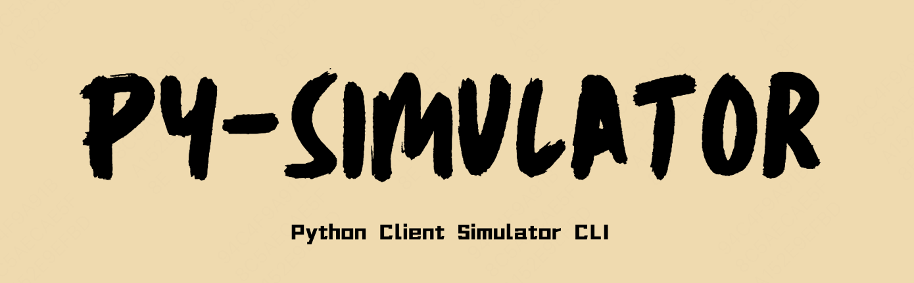

Apple Simulator Python Client.

# Thanks
- https://github.com/appium/node-simctl
- https://github.com/appium/appium-ios-simulator
- https://github.com/MobileNativeFoundation
- https://github.com/wix/AppleSimulatorUtils
- 